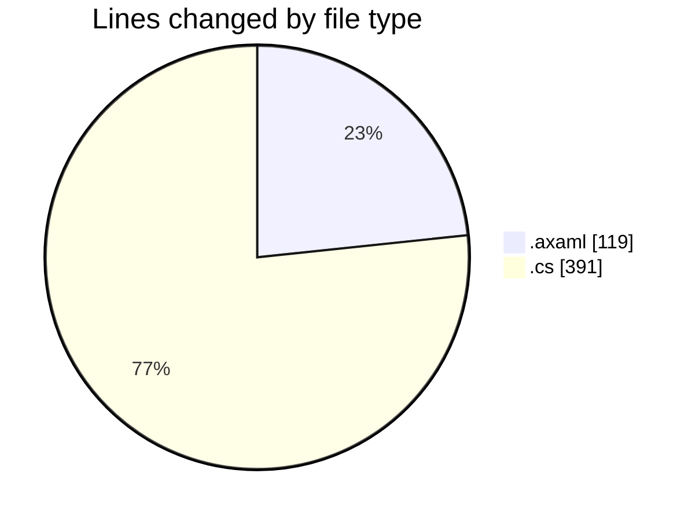
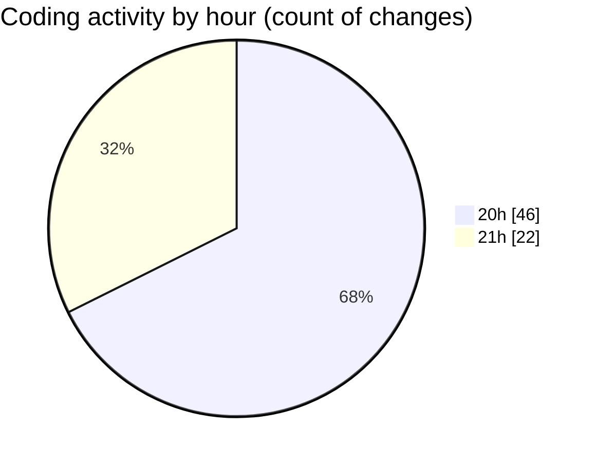

# SkinTrack - Activity Summary 

## Overall Statistics

| Stat                   | Value                                                             |
| ---------------------- | ----------------------------------------------------------------- |
| **Lines Added** (➕)   | 477                                          |
| **Lines Removed** (➖) | 33                                        |
| **Net Change** (↕)    | 444                |
| **Active Time** (⌚)   | 113 minutes |

## Modified Files
- **MainWindow.axaml** (+60, -0)
- **CarsView.axaml** (+29, -3)
- **CompetitionsView.axaml** (+26, -1)
- **Car.cs** (+28, -2)
- **Competition.cs** (+24, -0)
- **Skin.cs** (+47, -2)
- **CarsViewModel.cs** (+37, -8)
- **CompetitionsViewModel.cs** (+27, -0)
- **MainWindowViewModel.cs** (+59, -1)
- **CarsView.axaml.cs** (+13, -2)
- **DatabaseService.cs** (+34, -2)
- **SkinsViewModel.cs** (+15, -1)
- **MainWindow.axaml.cs** (+12, -1)
- **SkinsView.axaml.cs** (+13, -2)
- **CompetitionsView.axaml.cs** (+13, -2)
- **HomeView.axaml.cs** (+14, -3)
- **AppDbContext.cs** (+26, -3)

## Visualizations

### By File Type (Lines Changed)

### By Hour (Estimated Activity Count)

> **Last Updated:** 10/29/2025, 9:09:30 PM