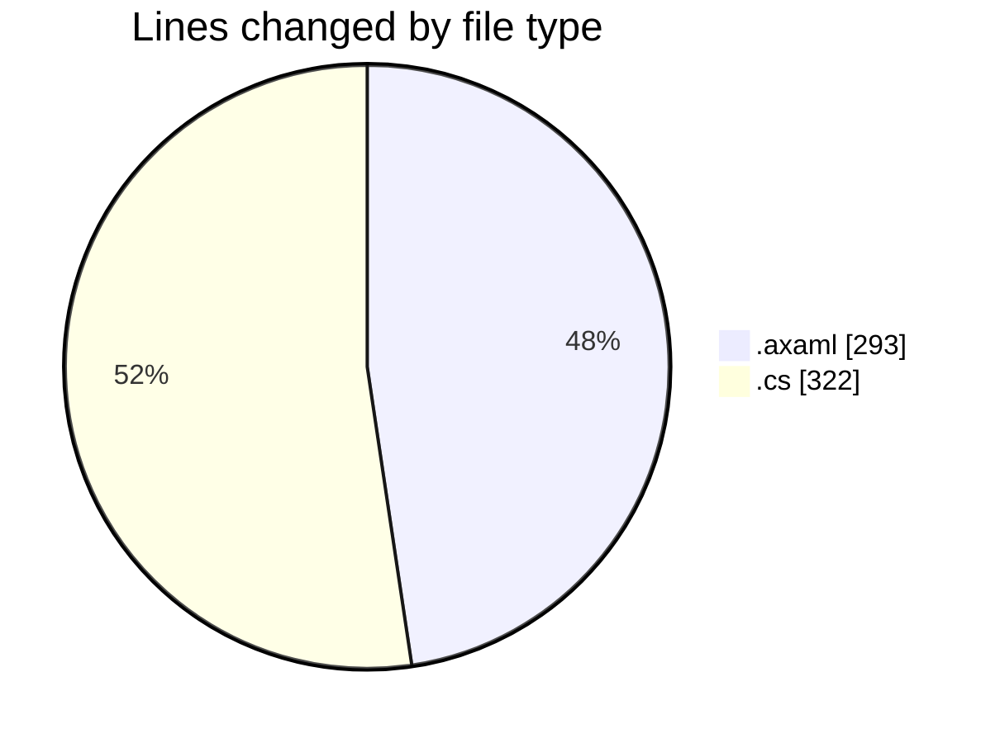
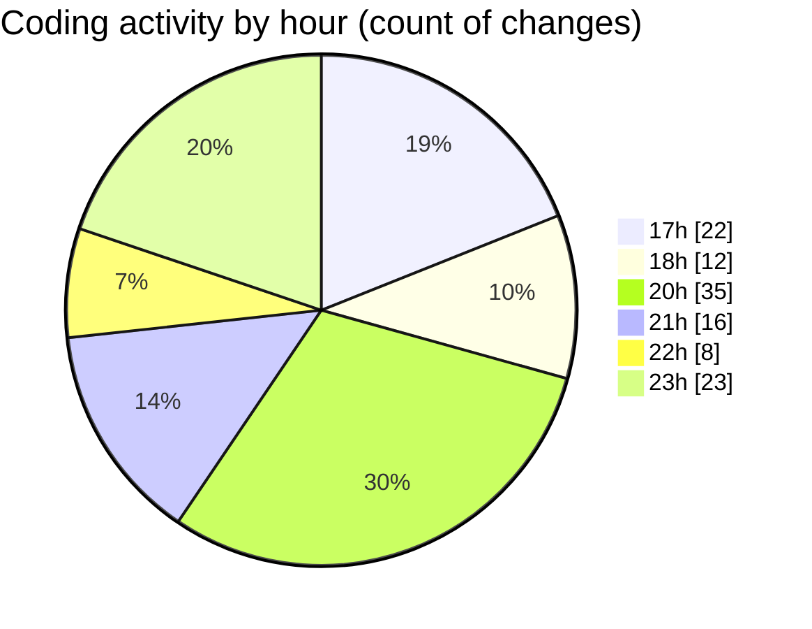

# SkinTrack - Activity Summary 

## Overall Statistics

| Stat                   | Value                                                             |
| ---------------------- | ----------------------------------------------------------------- |
| **Lines Added** (➕)   | 576                                          |
| **Lines Removed** (➖) | 39                                        |
| **Net Change** (↕)    | 537                |
| **Active Time** (⌚)   | 148 minutes |

## Modified Files
- **SkinsView.axaml** (+130, -5)
- **SkinsViewModel.cs** (+93, -5)
- **CarsViewModel.cs** (+29, -0)
- **CompetitionsViewModel.cs** (+27, -0)
- **DatabaseService.cs** (+38, -0)
- **HomeViewModel.cs** (+65, -6)
- **MainWindowViewModel.cs** (+59, -0)
- **HomeView.axaml** (+31, -3)
- **Icons.axaml** (+31, -17)
- **MainWindow.axaml** (+73, -3)

## Visualizations

### By File Type (Lines Changed)

### By Hour (Estimated Activity Count)

> **Last Updated:** 10/30/2025, 11:19:06 PM