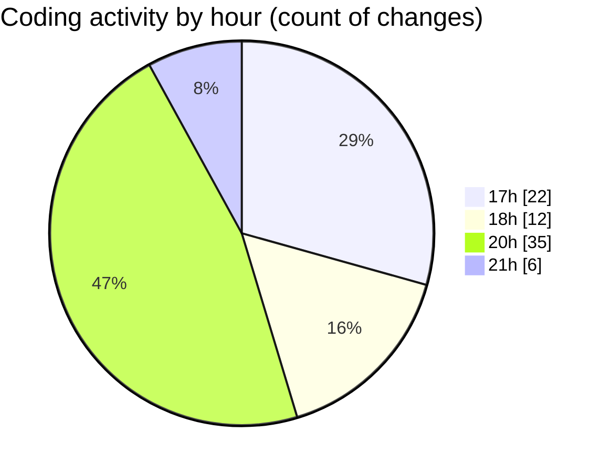

# SkinTrack - Activity Summary 

## Overall Statistics

| Stat                   | Value                                                             |
| ---------------------- | ----------------------------------------------------------------- |
| **Lines Added** (➕)   | 452                                          |
| **Lines Removed** (➖) | 18                                        |
| **Net Change** (↕)    | 434                |
| **Active Time** (⌚)   | 92 minutes |

## Modified Files
- **SkinsView.axaml** (+130, -5)
- **SkinsViewModel.cs** (+93, -5)
- **CarsViewModel.cs** (+29, -0)
- **CompetitionsViewModel.cs** (+27, -0)
- **DatabaseService.cs** (+38, -0)
- **HomeViewModel.cs** (+45, -6)
- **MainWindowViewModel.cs** (+59, -0)
- **HomeView.axaml** (+31, -2)

## Visualizations

### By File Type (Lines Changed)

### By Hour (Estimated Activity Count)

> **Last Updated:** 10/30/2025, 9:12:33 PM