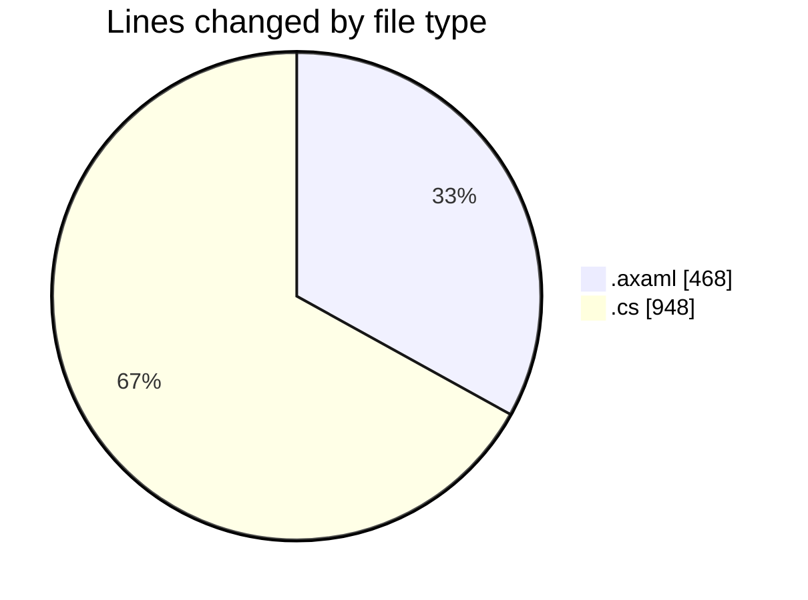
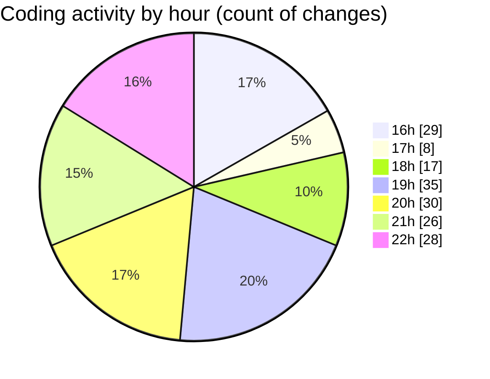

# SkinTrack - Activity Summary 

## Overall Statistics

| Stat                   | Value                                                             |
| ---------------------- | ----------------------------------------------------------------- |
| **Lines Added** (➕)   | 1288                                          |
| **Lines Removed** (➖) | 128                                        |
| **Net Change** (↕)    | 1160                |
| **Active Time** (⌚)   | 188 minutes |

## Modified Files
- **CompetitionsView.axaml** (+146, -5)
- **CompetitionsViewModel.cs** (+320, -52)
- **DatabaseService.cs** (+245, -13)
- **MainWindow.axaml** (+288, -6)
- **Icons.axaml** (+19, -4)
- **MainWindowViewModel.cs** (+211, -45)
- **HomeViewModel.cs** (+59, -3)

## Visualizations

### By File Type (Lines Changed)

### By Hour (Estimated Activity Count)

> **Last Updated:** 11/1/2025, 10:16:48 PM